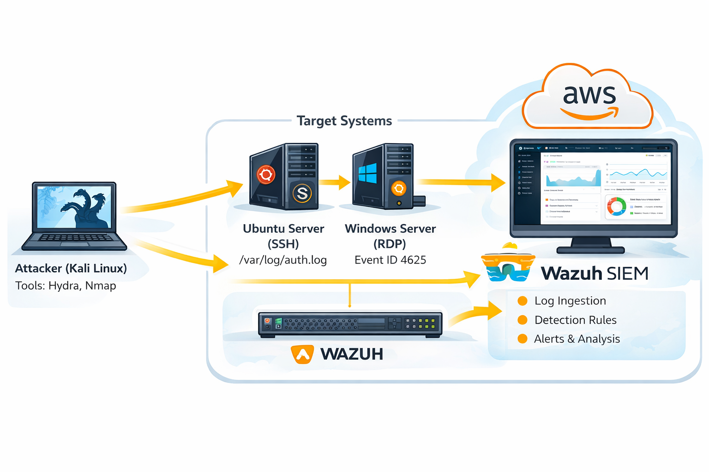

# AWS Cybersecurity SOC Lab (Attack & Detection Environment)

---

## Architecture Diagram

---

## Overview

This project demonstrates a cloud-based Security Operations Center (SOC) lab environment built in AWS using Wazuh SIEM for centralized monitoring, log collection, and security event detection across Windows and Linux systems.

The lab simulates real-world attack scenarios including SSH and RDP brute-force attempts and validates detection through centralized SIEM alerting and log correlation workflows.
---

## Lab Workflow (Actual Execution Order)

1. Build AWS infrastructure (EC2 instances + networking)
2. Configure target systems (Ubuntu + Windows Server)
3. Deploy Wazuh SIEM (server + dashboard)
4. Install and configure Wazuh agents
5. Simulate attacks using Kali (Hydra + Nmap)
6. Validate logs on each target system
7. Confirm detection inside Wazuh dashboard

---

## Environment Architecture
Attacker System
Kali Linux
Hydra
Nmap

## Target Systems
Ubuntu Server (SSH + Apache)
Windows Server 2022 (RDP Enabled)

## SIEM Platform
Wazuh Manager
Wazuh Dashboard
Wazuh Agents

---

## Technologies Used

- AWS EC2
- Wazuh SIEM (Manager, Agents, Dashboard)
- Ubuntu Linux
- Windows Server 2022
- Hydra (Brute-force tool)
- Nmap (Network scanning)
- SSH / RDP

---

# Attack Simulation & Detection (STEP-BY-STEP)

---

## 1. Reconnaissance (Kali)

- Identified open ports using Nmap
- Discovered:
  - SSH (22) on Ubuntu
  - RDP (3389) on Windows

---

## 2. SSH Brute Force Attack (Ubuntu)

- Tool: Hydra
- Target: Ubuntu SSH
- Wordlist: rockyou.txt

---

## 3. Linux Log Validation

- Checked `/var/log/auth.log`
- Observed multiple failed login attempts

---

## 4. RDP Brute Force Attack (Windows)

- Tool: Hydra
- Target: Windows RDP

---

## 5. Windows Log Validation

- Opened Event Viewer → Security Logs
- Filtered for:

---

## 6. SIEM Detection (Wazuh)

All logs were ingested and correlated in Wazuh:

- SSH brute-force detected (Linux)
- RDP brute-force detected (Windows)
- Source attacker IP identified

---

# Detection Details

## Linux (Ubuntu)
- Log: `/var/log/auth.log`
- Detection: Failed SSH login attempts
- Result: Alert generated in Wazuh

---

## Windows Server
- Log: Windows Security Logs
- Event ID: 4625
- Detection: Failed RDP login attempts
- Result: Alert generated in Wazuh

---

# SIEM Capabilities Demonstrated

- Centralized log collection (Linux + Windows)
- Real-time brute-force detection
- Cross-platform log correlation
- Source IP tracking
- Dashboard-based alert visualization

---

# Challenges & Fixes (REAL EXPERIENCE)

- Fixed Wazuh agent misconfiguration (`0.0.0.0` issue)
- Resolved agent version mismatch errors
- Enabled SSH password authentication for testing
- Configured AWS Security Groups (22, 3389, 1514, 443)
- Troubleshot service failures and connectivity issues

---

# SOC Analyst Perspective

If this were a real SOC environment:

- Investigate attacker IP reputation
- Correlate activity across systems
- Check for successful login after failures
- Apply account lockout policies
- Escalate if lateral movement suspected

---

# Detection Improvement Idea

- Alert if >5 failed logins within 1 minute
- Correlate across Linux + Windows
- Reduce false positives and improve detection accuracy

---

# Screenshot Structure

/screenshots
├── 01-attacker-kali
├── 02-target-ubuntu
├── 03-target-windows
├── 04-wazuh-siem

---

# Summary

This lab demonstrates the full SOC workflow:

Attack → Log Generation → Log Collection → SIEM Detection → Alert Analysis

---

## 👤 Author

Michael Henry
