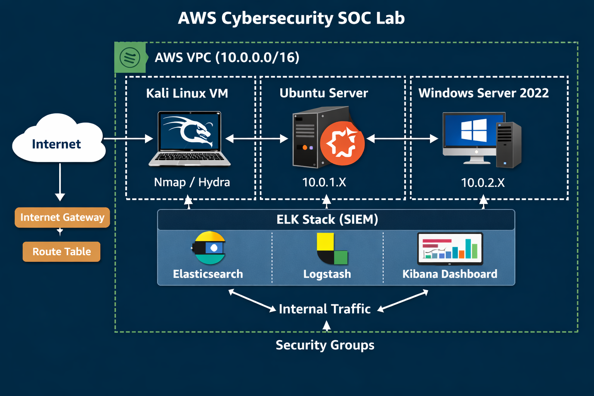

# AWS Cybersecurity SOC Lab (Attack & Detection Environment)

---

## Overview
This project demonstrates a hands-on cybersecurity lab built in Amazon Web Services (AWS). The lab simulates real-world attack scenarios and detection techniques using cloud infrastructure.

---

## What This Demonstrates

- Simulated real-world cyber attacks (Nmap, Hydra)
- Detected threats using SIEM (ELK Stack)
- Correlated attacks across Linux and Windows systems
- Built full cloud infrastructure in AWS (VPC, routing, security groups)

---

## Architecture
- AWS VPC (10.0.0.0/16)
- Kali Linux (Attacker)
- Ubuntu Server (Linux Target)
- Windows Server 2022 (Target)
- Internet Gateway + Route Tables
- Security Groups (Controlled Access)

---

## Attack Simulation
- Network scanning using Nmap
- Brute-force attacks using Hydra (SSH & RDP)

---

## Detection & Logging

### Linux
- Log file: `/var/log/auth.log`
- Detected failed SSH login attempts

### Windows
- Event Viewer → Security Logs
- Event ID 4625 (Failed logins)

---

## SIEM Integration (ELK Stack)

To simulate a real Security Operations Center (SOC), the lab was extended using the ELK Stack:

- Elasticsearch: Log storage and indexing
- Logstash: Log ingestion and parsing
- Kibana: Visualization dashboard

### Log Source
- Linux: `/var/log/auth.log`
- Windows: Security Event Logs via Winlogbeat

### Detection Logic
- Failed SSH login attempts
- Failed RDP login attempts
- Brute-force detection thresholds

### Visualization
- Kibana dashboards for:
  - Failed login attempts over time
  - Attack frequency
  - Brute-force detection

---

## Alerts & Detection

Implemented alerting using Kibana:

- Trigger: More than 5 failed login attempts within 1 minute
- Queries:
  - `"Failed password"` (Linux)
  - `event.code:4625` (Windows)

---

## Incident Response Workflow

1. Detection (Alert triggered)
2. Triage (Identify source IP and scope)
3. Investigation (Analyze logs in Kibana)
4. Correlation (Linux + Windows attacks)
5. Response (Simulated blocking of attacker IP)

---

## Tools Used
- Nmap
- Hydra
- ELK Stack (Elasticsearch, Logstash, Kibana)
- AWS Cloud Infrastructure

---

## Key Skills Demonstrated
- AWS Networking (VPC, Subnets, Security Groups)
- Offensive Security (Scanning, Brute Force)
- Log Analysis & Threat Detection
- SIEM Implementation (ELK Stack)
- Incident Response

---

## How to Reproduce

1. Launch EC2 instances (Kali, Ubuntu, Windows)
2. Configure Security Groups (SSH, RDP, internal traffic)
3. Run attacks from Kali:# AWS-Lab
AWS Lab for cybersecurity
# AWS Cybersecurity Lab (Attack & Detection Environment)

## Overview
This project demonstrates a hands-on cybersecurity lab built in Amazon Web Services (AWS). The lab simulates real-world attack scenarios and detection techniques using cloud infrastructure.

## Architecture
- AWS VPC (10.0.0.0/16)
- Kali Linux (Attacker)
- Ubuntu Server (Linux Target)
- Windows Server 2022 (Target)
- Internet Gateway + Route Tables
- Security Groups (Controlled Access)

## Attack Simulation
- Network scanning using Nmap
- Brute-force attacks using Hydra (SSH & RDP)

## Detection & Logging
### Linux
- Log file: `/var/log/auth.log`
- Detected failed SSH login attempts

### Windows
- Event Viewer → Security Logs
- Event ID 4625 (Failed logins)

## SIEM & Monitoring (Extended)
- AWS CloudWatch (log monitoring)
- ELK Stack (optional enhancement)
  - Elasticsearch
  - Logstash
  - Kibana

## Key Skills Demonstrated
- Cloud Networking (VPC, Subnets, Routing)
- Offensive Security (Nmap, Hydra)
- Log Analysis & Threat Detection
- Windows & Linux Security Monitoring

## Lab Diagram

## How to Reproduce
1. Launch EC2 instances (Kali, Ubuntu, Windows)
2. Configure Security Groups (SSH, RDP, internal traffic)
3. Run attacks from Kali:
   - `nmap <target>`
   - `hydra -l ubuntu -P rockyou.txt ssh://<target>`
4. Monitor logs on Ubuntu and Windows

## Author
Michael Henry
